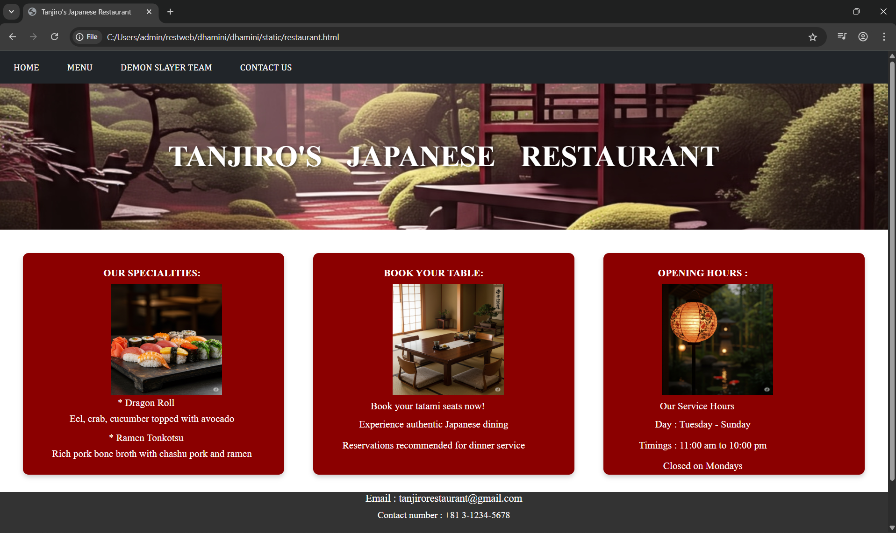
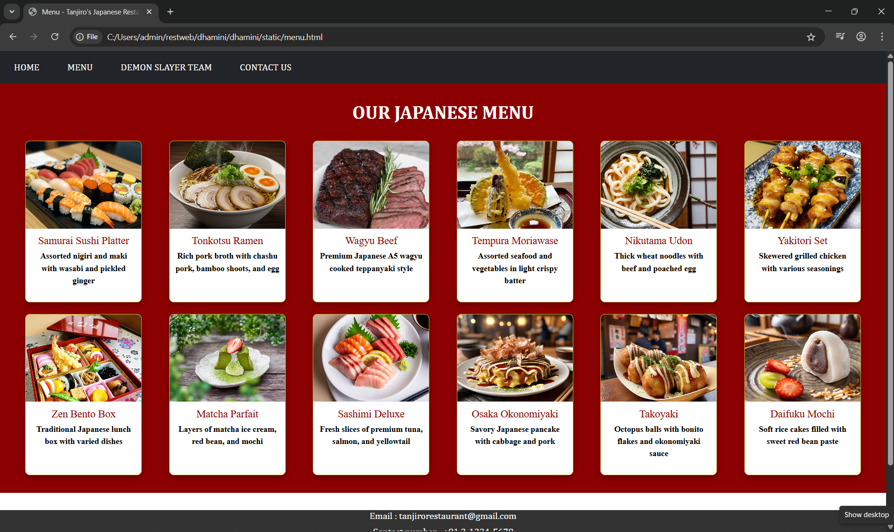
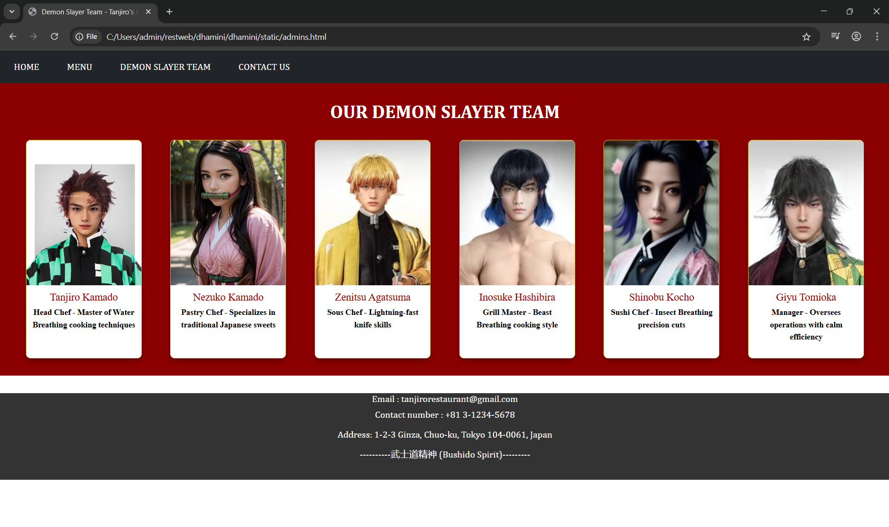

# Ex.07 Restaurant Website
## Date:18-05-2025

## AIM:
To develop a static Restaurant website to display the food items and services provided by them.

## DESIGN STEPS:

### Step 1:
Requirement collection.

### Step 2:
Creating the layout using HTML and CSS.

### Step 3:
Updating the sample content.

### Step 4:
Choose the appropriate style and color scheme.

### Step 5:
Validate the layout in various browsers.

### Step 6:
Validate the HTML code.

### Step 7:
Publish the website in the given URL.

## PROGRAM:
```
restaurant.html

<html>
<head>
    <link href="design.css" rel="stylesheet">
    <link href="https://cdn.jsdelivr.net/npm/bootstrap@5.3.3/dist/css/bootstrap.min.css" rel="stylesheet">        
    <script src="https://cdn.jsdelivr.net/npm/bootstrap@5.3.3/dist/js/bootstrap.bundle.min.js">
    </script>
  
  <title>Tanjiro's Japanese Restaurant</title>
  <style>
    
    .navi
    {
        font-family: Cambria, Cochin, Georgia, Times, 'Times New Roman', serif;
    }

    .banner {
      background-image: url('b.jpg'); 
      background-size: cover;
      background-position: center;
      height: 250px;
      position: relative;
      display: flex;
      align-items: center;
      justify-content: center;
      color: white;
      text-shadow: 2px 2px 6px rgba(0, 0, 0, 0.7);
      word-spacing: 30;
    }

    .banner h1 {
      font-family: 'TIMES NEW ROMAN';
      font-size: 50px;
      margin: 0;
      font-weight: bold;
    }
    
    .box-section {
      display: flex;
      flex-direction: row;
      justify-content: flex-start;
      gap: 50px;
      margin-top: 40px;
      margin-left: 40px;   
      margin-right: 40px;
    }

    .info-box {
      background-color:darkred; /* Dark red */
      color: white;
      width: 700px;
      height: 380px;
      display: flex;
      font-family: 'times new roman';
      font-weight: bold;
      border-radius: 10px;
      font-size: 17px;
      box-shadow: 0 4px 8px rgba(0, 0, 0, 0.2);
    }
    
    .menu-content h3 {
      margin-left: 30;
      font-size: 17px;
      margin-bottom: 4px;
    }
    
    .menu-content h2 {
      margin-left: 50;
      font-size: 17px;
      margin: top 1px;
      font-family:'times new roman';
      font-weight: bold;
    }

    .menu-content p {
      margin-left: 50;
      font-size: 17px;
      margin-bottom: 10px;
      font-weight: normal;
    }
    
    .image {
      margin-left: 100;
    }
  </style>
</head>
<body>
    <div class="navi">
    <nav class="navbar navbar-expand-sm bg-dark">
            <ul class="navbar-nav">
                <li class="nav-item bg-dark mx-3">
                    <a class="nav-link text-white" href="restaurant.html">HOME</a>
                </li>
                <li class="nav-item bg-dark mx-3">
                    <a class="nav-link text-white" href="menu.html">MENU</a>
                </li>
                <li class="nav-item bg-dark mx-3">
                    <a class="nav-link text-white" href="admins.html">DEMON SLAYER TEAM</a>
                </li>
                <li class="nav-item bg-dark mx-3">
                    <a class="nav-link text-white" href="contact.html">CONTACT US</a>
                </li>
            </ul>
        </nav>
    </div>

  <div class="banner">
    <h1>TANJIRO'S JAPANESE RESTAURANT</h1> 
  </div>
  
    <div class="box-section">
        <div class="info-box">
          <div class="menu-content">
            <center>
                <br>
              <h2>OUR SPECIALITIES:</h2>
            <center></center>
            <h3 style="margin-top: 4;">*  Dragon Roll</h3>
              <p>Eel, crab, cucumber topped with avocado </p>
              <h3 style="margin-top: 4;">*  Ramen Tonkotsu</h3>
              <p>Rich pork bone broth with chashu pork and ramen</p>
              
            </center>
          </div>
        </div>
          
        <div class="info-box">
          <div class="menu-content">
            <center>
            <br>
              <h2>BOOK YOUR TABLE:</h2>
            <center></center>
              <h3 style="margin-top: 9;">Book your tatami seats now!</h3>
              <p style="margin-top: 9;"> Experience authentic Japanese dining</p>
              <p style="margin-top: 9;"> Reservations recommended for dinner service</p>
            </center>
          </div>
        </div>
        
        <div class="info-box">
          <div class="menu-content">
            <center>
                <br>
              <h2>OPENING HOURS :</h2>
            <center></center>
              <h3 style="margin-top: 9;">Our Service Hours</h3>
              <p style="margin-top: 9;">Day : Tuesday - Sunday</p>
              <p style="margin-top: 9;">Timings : 11:00 am to 10:00 pm</p>
              <p style="margin-top: 9;">Closed on Mondays</p>
            </center>
          </div>
        </div>
      </div>
</body>
<footer style="background-color:#333;height:150px;width:100%;color:white;text-align:center;font-family:'Times New Roman', Times, serif;font: size 15px;margin-top:30px;">
    <h2 style="font-size:large;">Email : tanjirorestaurant@gmail.com</h2>
    <h2 style="font-size:medium;">Contact number : +81 3-1234-5678</h2><br>
    <h2 style="font-size:medium;">Address: 1-2-3 Ginza, Chuo-ku, Tokyo 104-0061, Japan</h2>
    <h2 style="font-size:medium;">----------武士道精神 (Bushido Spirit)---------</h2>
</footer>
</html>

 menu.html

 <html>
<head>
    <link href="design.css" rel="stylesheet">
    <link href="https://cdn.jsdelivr.net/npm/bootstrap@5.3.3/dist/css/bootstrap.min.css" rel="stylesheet">        
    <script src="https://cdn.jsdelivr.net/npm/bootstrap@5.3.3/dist/js/bootstrap.bundle.min.js">
    </script>
  
  <title>Menu - Tanjiro's Japanese Restaurant</title>
  <style>
    .navi {
        font-family: Cambria, Cochin, Georgia, Times, 'Times New Roman', serif;
    }
    
    .menu-section {
      background-color: #8B0000;
      padding: 30px;
      color: #fff;
      text-align: center;
      font-family: 'times new roman';
      font-weight: bold;
    }

    .menu-title {
      color: white;
      font-size: 32px;
      margin-bottom: 30px;
      font-family: Cambria, Cochin, Georgia, Times, 'Times New Roman', serif;
      font-weight: bold;
    }

    .menu-grid {
      display: grid;
      grid-template-columns: repeat(auto-fit, minmax(200px, 1fr));
      gap: 20px;
      justify-items: center;
    }

    .menu-card {
      background-color: white;
      color: black;
      border-radius: 8px;
      overflow: hidden;
      width: 200px;
      box-shadow: 0 4px 8px rgba(0,0,0,0.3);
      text-align: center;
      border: 1px solid #D4AF37;
    }

    .menu-card img {
      width: 100%;
      height: 150px;
      object-fit: cover;
    }

    .menu-card h3 {
      font-size: 18px;
      margin: 10px 0 5px;
      color: #8B0000;
    }

    .menu-card p {
      font-size: 14px;
      padding: 0 10px 10px;
    }
  </style>
</head>
<body>
    <div class="navi">
    <nav class="navbar navbar-expand-sm bg-dark">
            <ul class="navbar-nav">
                <li class="nav-item bg-dark mx-3">
                    <a class="nav-link text-white" href="restaurant.html">HOME</a>
                </li>
                <li class="nav-item bg-dark mx-3">
                    <a class="nav-link text-white" href="menu.html">MENU</a>
                </li>
                <li class="nav-item bg-dark mx-3">
                    <a class="nav-link text-white" href="admins.html">DEMON SLAYER TEAM</a>
                </li>
                <li class="nav-item bg-dark mx-3">
                    <a class="nav-link text-white" href="contact.html">CONTACT US</a>
                </li>
            </ul>
        </nav>
    </div>
    
    <div class="menu-section">
      <h2 class="menu-title">OUR JAPANESE MENU</h2>
      <div class="menu-grid">
        <div class="menu-card">
          
          <h3>Samurai Sushi Platter</h3>
          <p>Assorted nigiri and maki with wasabi and pickled ginger</p>
        </div>
        <div class="menu-card">
          
          <h3>Tonkotsu Ramen</h3>
          <p>Rich pork broth with chashu pork, bamboo shoots, and egg</p>
        </div>
        <div class="menu-card">
          
          <h3>Wagyu Beef</h3>
          <p>Premium Japanese A5 wagyu cooked teppanyaki style</p>
        </div>
        <div class="menu-card">
          
          <h3>Tempura Moriawase</h3>
          <p>Assorted seafood and vegetables in light crispy batter</p>
        </div>
        <div class="menu-card">
          
          <h3>Nikutama Udon</h3>
          <p>Thick wheat noodles with beef and poached egg</p>
        </div>
        <div class="menu-card">
          
          <h3>Yakitori Set</h3>
          <p>Skewered grilled chicken with various seasonings</p>
        </div>
        <div class="menu-card">
          
          <h3>Zen Bento Box</h3>
          <p>Traditional Japanese lunch box with varied dishes</p>
        </div>
        <div class="menu-card">
          
          <h3>Matcha Parfait</h3>
          <p>Layers of matcha ice cream, red bean, and mochi</p>
        </div>
        <div class="menu-card">
          
          <h3>Sashimi Deluxe</h3>
          <p>Fresh slices of premium tuna, salmon, and yellowtail</p>
        </div>
        <div class="menu-card">
          
          <h3>Osaka Okonomiyaki</h3>
          <p>Savory Japanese pancake with cabbage and pork</p>
        </div>
        <div class="menu-card">
          
          <h3>Takoyaki</h3>
          <p>Octopus balls with bonito flakes and okonomiyaki sauce</p>
        </div>
        <div class="menu-card">
          
          <h3>Daifuku Mochi</h3>
          <p>Soft rice cakes filled with sweet red bean paste</p>
        </div>
      </div>
    </div>
</body>
<footer style="background-color:#333;height:150px;width:100%;color:white;text-align:center;font-family:Cambria, Cochin, Georgia, Times, 'Times New Roman', serif;font-size:5px;margin-top:30px;">
    <h2 style="font-size:medium; margin-top:4px;">Email : tanjirorestaurant@gmail.com</h2>
    <h2 style="font-size:medium;">Contact number : +81 3-1234-5678</h2><br>
    <h2 style="font-size:medium;">Address: 1-2-3 Ginza, Chuo-ku, Tokyo 104-0061, Japan</h2>
    <br>
    <h2 style="font-size:medium;">----------武士道精神 (Bushido Spirit)---------</h2>
</footer>
</html>

admins.html

<html>
<head>
    <link href="design.css" rel="stylesheet">
    <link href="https://cdn.jsdelivr.net/npm/bootstrap@5.3.3/dist/css/bootstrap.min.css" rel="stylesheet">        
    <script src="https://cdn.jsdelivr.net/npm/bootstrap@5.3.3/dist/js/bootstrap.bundle.min.js">
    </script>
  
  <title>Demon Slayer Team - Tanjiro's Japanese Restaurant</title>
  <style>
    .navi {
        font-family: Cambria, Cochin, Georgia, Times, 'Times New Roman', serif;
    }
    
    .menu-section {
      background-color: #8B0000;
      padding: 30px;
      color: #fff;
      text-align: center;
      font-family: 'times new roman';
      font-weight: bold;
      
    }

    .menu-title {
      color: white;
      font-size: 32px;
      margin-bottom: 30px;
      font-family: Cambria, Cochin, Georgia, Times, 'Times New Roman', serif;
      font-weight: bold;
    }

    .menu-grid {
      display: grid;
      grid-template-columns: repeat(auto-fit, minmax(200px, 1fr));
      gap: 20px;
      justify-items: center;
    }

    .menu-card {
      background-color: white;
      color: black;
      border-radius: 8px;
      overflow: hidden;
      width: 200px;
      box-shadow: 0 4px 8px rgba(0,0,0,0.3);
      text-align: center;
      border: 1px solid #D4AF37;
    }

    .menu-card img {
      width: 100%;
      height: 250px;
      object-fit: cover;
    }

    .menu-card h3 {
      font-size: 18px;
      margin: 10px 0 5px;
      
      color: #8B0000;
    }

    .menu-card p {
      font-size: 14px;
      padding: 0 10px 10px;
    }
  </style>
</head>
<body>
    <div class="navi">
    <nav class="navbar navbar-expand-sm bg-dark">
            <ul class="navbar-nav">
                <li class="nav-item bg-dark mx-3">
                    <a class="nav-link text-white" href="restaurant.html">HOME</a>
                </li>
                <li class="nav-item bg-dark mx-3">
                    <a class="nav-link text-white" href="menu.html">MENU</a>
                </li>
                <li class="nav-item bg-dark mx-3">
                    <a class="nav-link text-white" href="admins.html">DEMON SLAYER TEAM</a>
                </li>
                <li class="nav-item bg-dark mx-3">
                    <a class="nav-link text-white" href="contact.html">CONTACT US</a>
                </li>
            </ul>
        </nav>
    </div>
    
    <div class="menu-section">
      <h2 class="menu-title">OUR DEMON SLAYER TEAM</h2>
      <div class="menu-grid">
        <div class="menu-card">
          
          <h3>Tanjiro Kamado</h3>
          <p>Head Chef - Master of Water Breathing cooking techniques</p>
        </div>
        <div class="menu-card">
          
          <h3>Nezuko Kamado</h3>
          <p>Pastry Chef - Specializes in traditional Japanese sweets</p>
        </div>
        <div class="menu-card">
          
          <h3>Zenitsu Agatsuma</h3>
          <p>Sous Chef - Lightning-fast knife skills</p>
        </div>
        <div class="menu-card">
          
          <h3>Inosuke Hashibira</h3>
          <p>Grill Master - Beast Breathing cooking style</p>
        </div>
        <div class="menu-card">
          
          <h3>Shinobu Kocho</h3>
          <p>Sushi Chef - Insect Breathing precision cuts</p>
        </div>
        <div class="menu-card">
          
          <h3>Giyu Tomioka</h3>
          <p>Manager - Oversees operations with calm efficiency</p>
        </div>
      </div>
    </div>
</body>
<footer style="background-color:#333;height:150px;width:100%;color:white;text-align:center;font-family:Cambria, Cochin, Georgia, Times, 'Times New Roman', serif;font-size:5px;margin-top:30px;">
    <h2 style="font-size:medium; margin-top:4px;">Email : tanjirorestaurant@gmail.com</h2>
    <h2 style="font-size:medium;">Contact number : +81 3-1234-5678</h2><br>
    <h2 style="font-size:medium;">Address: 1-2-3 Ginza, Chuo-ku, Tokyo 104-0061, Japan</h2>
    <br>
    <h2 style="font-size:medium;">----------武士道精神 (Bushido Spirit)---------</h2>
</footer>
</html>

contact.html

<html>
<head>
    <link href="design.css" rel="stylesheet">
    <link href="https://cdn.jsdelivr.net/npm/bootstrap@5.3.3/dist/css/bootstrap.min.css" rel="stylesheet">        
    <script src="https://cdn.jsdelivr.net/npm/bootstrap@5.3.3/dist/js/bootstrap.bundle.min.js">
    </script>
  
    <title>Contact Us - Tanjiro's Japanese Restaurant</title>
    <style>
    .navi {
        font-family: Cambria, Cochin, Georgia, Times, 'Times New Roman', serif;
    }
    
    body {
        background-image: url('japanese-pattern.jpg');
        background-size: cover;
    }
    
    .contact-section h1 {
        font-size: 32px;
        color: #8B0000;
        margin-bottom: 30px;
        text-align: center;
        font-family: Cambria, Cochin, Georgia, Times, 'Times New Roman', serif;
      font-weight: bold;
    }

    .contact-box {
        background-color: #8B0000;
        color: white;
        padding: 20px;
        margin: 0 auto;
        width: 700px;
        border-radius: 10px;
        box-shadow: 0 4px 8px rgba(0,0,0,0.3);
        margin-top: 50px;
        border: 2px solid #D4AF37;
    }

    .contact-box p {
        font-size: 16px;
        margin: 10px 0;
        margin-top: 20px;
    }
    </style>
</head>
<body>
    <div class="navi">
    <nav class="navbar navbar-expand-sm bg-dark">
            <ul class="navbar-nav">
                <li class="nav-item bg-dark mx-3">
                    <a class="nav-link text-white" href="restaurant.html">HOME</a>
                </li>
                <li class="nav-item bg-dark mx-3">
                    <a class="nav-link text-white" href="menu.html">MENU</a>
                </li>
                <li class="nav-item bg-dark mx-3">
                    <a class="nav-link text-white" href="admins.html">DEMON SLAYER TEAM</a>
                </li>
                <li class="nav-item bg-dark mx-3">
                    <a class="nav-link text-white" href="contact.html">CONTACT US</a>
                </li>
            </ul>
        </nav>
    </div>
    
    <div class="contact-section">
        <br>
        <h1>CONTACT US</h1>
        <div class="contact-box">
            <p><strong>Restaurant:</strong> Tanjiro's Japanese Restaurant</p>
            <p><strong>Address:</strong> 1-2-3 Ginza, Chuo-ku, Tokyo 104-0061, Japan</p>
            <p><strong>Phone:</strong> +81 3-1234-5678</p>
            <p><strong>Email:</strong> tanjirorestaurant@gmail.com</p>
            <p><strong>Reservations:</strong> Recommended for dinner service</p>
            <p><strong>Private Events:</strong> Available for traditional tea ceremonies and kaiseki dinners</p>
        </div>
    </div>
</body>
<footer style="background-color:#333;height:150px;width:100%;color:white;text-align:center;font-family:Cambria, Cochin, Georgia, Times, 'Times New Roman', serif;font-size:5px;margin-top:30px;">
    <h2 style="font-size:medium; margin-top:4px;">Email : tanjirorestaurant@gmail.com</h2>
    <h2 style="font-size:medium;">Contact number : +81 3-1234-5678</h2><br>
    <h2 style="font-size:medium;">Address: 1-2-3 Ginza, Chuo-ku, Tokyo 104-0061, Japan</h2>
    <br>
    <h2 style="font-size:medium;">----------武士道精神 (Bushido Spirit)---------</h2>
</footer>
</html>
```
## OUTPUT:





## RESULT:
The program for designing software company website using HTML and CSS is completed successfully.
